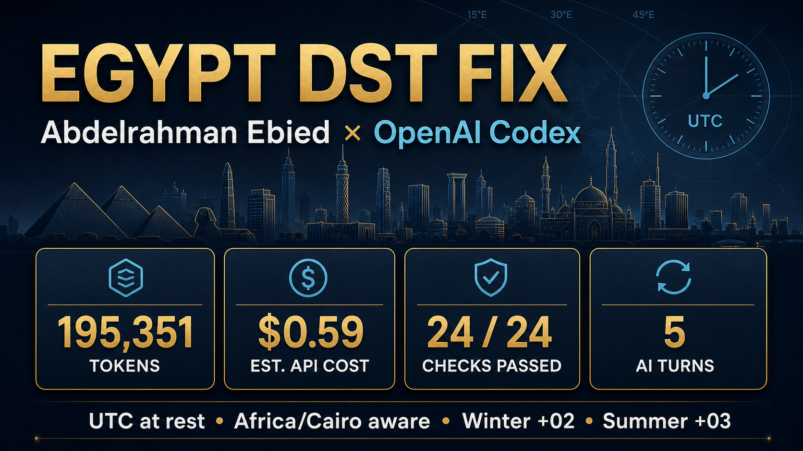

# CIP Egypt DST Fix

### A verified DST-safe clock-in pipeline by Abdelrahman Ebied



This contest submission fixes CIP's Egypt summer-time regression without
hardcoding a year-round offset. Clock-ins remain UTC at rest and render through
the date-specific `Africa/Cairo` IANA rules.

| Proof | Result |
|---|---:|
| Regression checks | **24 / 24 passed** |
| Cairo winter offset | **UTC+02:00** |
| Cairo summer offset | **UTC+03:00** |
| Storage invariant | **UTC/GMT at rest** |
| AI tool | **OpenAI Codex** |
| AI interaction turns | **5** |
| Fix-publication token snapshot | **195,351** |
| Estimated GPT-5 API-equivalent cost | **$0.59** |

## Before → after

| Scenario | Before | After |
|---|---:|---:|
| Cairo summer clock-in | `09:00` | `09:00` |
| CIP displayed | `08:00` ❌ | `09:00` ✅ |
| Cairo winter clock-in | `09:00` | `09:00` |
| CIP displayed | `09:00` | `09:00` ✅ |

## Root cause

CIP reduced `Africa/Cairo` to a timezone-less wall string and later reparsed it
through PHP's process-global timezone. A fixed `+02:00` default or stale tzdata
therefore omitted Egypt's restored summer `+03:00` rule. The seeded
`(GMT+02:00) Cairo` label and numeric offsets are metadata, not date-aware
conversion rules.

## The fix

- Capture clock-ins as Unix timestamps, which identify unambiguous instants.
- Format stored values explicitly as UTC/GMT.
- Parse database values explicitly as UTC before rendering.
- Render through the person's IANA zone instead of a label-derived offset.
- Replace fixed-offset calendar arithmetic with instant-specific IANA
  conversion.

Current OS/PHP tzdata remains a deployment prerequisite; application code
should not duplicate Egypt's civil-time rules.

## Verify it

Requires PHP CLI:

```bash
php reproduce.php
```

Expected:

```text
Timezone database: 2025.2
Result: 24 passed, 0 failed
```

The harness covers winter, summer, both sides of both 2026 DST transitions, a
fixed-`+02:00` process default, invalid inputs, UTC storage, local rendering,
and the calendar path.

## Repository

| File | Purpose |
|---|---|
| [`isolated-bug.php`](isolated-bug.php) | DST-safe capture, UTC storage, and IANA rendering helpers |
| [`reproduce.php`](reproduce.php) | Deterministic 24-check regression harness |
| [`SUBMISSION.md`](SUBMISSION.md) | Root cause, fix rationale, AI log, and transparent cost assumptions |
| [`assets/egypt-dst-fix-token-usage.png`](assets/egypt-dst-fix-token-usage.png) | Shareable fix-results infographic |

## AI-assisted engineering

One AI tool—OpenAI Codex—was used across five interaction turns. Codex goal
telemetry recorded **195,351 tokens** immediately before fix publication,
averaging approximately **39,070 combined tokens per turn** because the
telemetry does not expose an input/output split.

Using GPT-5 standard API rates of
[$1.25/M input and $10/M output](https://developers.openai.com/api/docs/models/gpt-5),
an 80% input / 20% output assumption gives an API-equivalent estimate of
**$0.59**. The possible all-input to all-output range is **$0.24–$1.95**;
actual Codex subscription billing may differ.

See [`SUBMISSION.md`](SUBMISSION.md) for the full disclosure.

## Constraint proof

- ✅ No year-round `UTC+3` hardcode
- ✅ No label-only `GMT+03:00` rename
- ✅ No framework rewrite or added dependency
- ✅ UTC/GMT storage preserved
- ✅ Summer, winter, and transition boundaries tested
- ✅ Invalid timestamps and timezone identifiers fail safely

---

Original contest: Softxpert AI Expert Initiative — CIP Egypt Summer Time AI
Prompt Contest.
